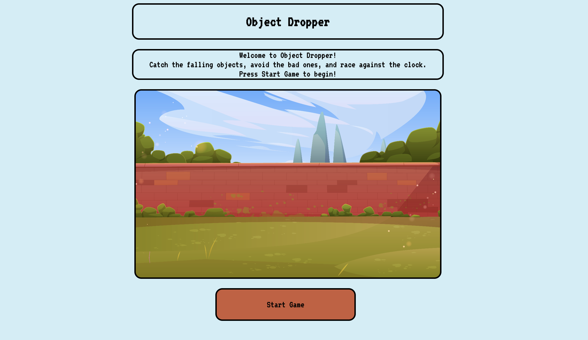

# Object Dropper

## Features:
- 30-second timed challenge.

- Falling objects that increase or decrease the score.

- Winning and losing evaluation based on score.

- Left and right controls using keyboard arrows.

- Dynamic Start/Reset Button.

- Countdown till game start.

## Game Screenshots:

## Getting Started:

[Game Link](https://nawaf-aljar.github.io/Object-Dropper/)

## User Stories:  

1. As a user, I want to see a home page that contains information about the page. 

2. As a user, I want to see a start button to start playing the game. 

3. As a user, I want to move left and right to avoid or collect falling objects. 

4. As a user, I want the game to end when the time ends so that I know if i lost or won. 

5. As a user, I want to know when the game starts.

6. As a user, I want to see a timer on the page. 

7. As a user, I want clear messages indicating winning or losing. 

8. As a user, I want to play again. 

## Mockups

## Pseudocode:  

1) Define needed variables. 

2) The game state should be initialized at the loading, and a function should be called to render this game state. 

3) Use a function to handle the user button clicking. 

4) Display timer on page.

5) Display score on page.

6) Display a countdown when the game start.

6) Display status after game is finished Win/Loss. 

7) Create Reset functionality.

## Techonologies Used:

- HTML

- CSS

- JavaScript

## Next Step:

- Add extra levels

- Add additional objects

-  improve design 
